# Laboratorio 4: Adquisición de ECG con BITalino y OpenSignals

## Introducción

La sesión permitió estudiar los fundamentos del electrocardiograma (ECG) y evaluar experimentalmente las derivaciones bipolares de Einthoven. La actividad eléctrica cardíaca se registró mediante electrodos superficiales conectados al sistema **BITalino (r)evolution** y se visualizó con **OpenSignals (r)evolution)**.

Durante la práctica se obtuvieron registros en reposo y bajo cambios voluntarios de la respiración. También se realizó actividad física para observar de forma cualitativa el efecto del movimiento y el esfuerzo sobre la adquisición. Finalmente, los registros de OpenSignals fueron exportados y procesados en Python para visualizar las señales fuera del software de adquisición.

---

## Objetivos

- Adquirir señales de ECG mediante electrodos superficiales.
- Configurar correctamente BITalino y OpenSignals.
- Reconocer los principales componentes de una señal electrocardiográfica.
- Comparar las derivaciones D1, D2 y D3 de Einthoven.
- Observar la influencia de la respiración y del movimiento sobre el ECG.
- Leer y representar en Python los archivos generados durante la adquisición.

---

# 1. Fundamento teórico

## 1.1. Actividad eléctrica del corazón

El ECG registra diferencias de potencial producidas por los procesos de **despolarización** y **repolarización** del miocardio.

La actividad eléctrica normal se inicia en el **nódulo sinoauricular (SA)**, considerado el marcapasos fisiológico del corazón. El impulso se propaga por las aurículas, alcanza el **nódulo auriculoventricular (AV)**, continúa por el **Haz de His**, sus ramas derecha e izquierda y finalmente por las **fibras de Purkinje** hacia el miocardio ventricular.

**Secuencia general:**

`Nodo SA → aurículas → nodo AV → Haz de His → ramas → fibras de Purkinje → ventrículos`

El retraso de conducción en el nodo AV permite que la contracción auricular finalice antes de la activación ventricular.

## 1.2. Componentes principales del ECG

- **Onda P:** despolarización auricular.
- **Intervalo PR:** tiempo desde el inicio de la despolarización auricular hasta el inicio de la despolarización ventricular.
- **Complejo QRS:** despolarización ventricular.
- **Segmento ST:** periodo en el que los ventrículos permanecen despolarizados.
- **Onda T:** repolarización ventricular.

Una onda de despolarización que se dirige hacia el electrodo positivo produce una deflexión positiva; si se aleja, produce una deflexión negativa. Por ello, la forma y amplitud del ECG cambian al modificar la derivación.

## 1.3. Derivaciones de Einthoven

| Derivación | Electrodo negativo | Electrodo positivo | Dirección aproximada |
|---|---|---|---:|
| D1 | Brazo derecho (RA) | Brazo izquierdo (LA) | 0° |
| D2 | Brazo derecho (RA) | Pierna izquierda (LL) | +60° |
| D3 | Brazo izquierdo (LA) | Pierna izquierda (LL) | +120° |

Las tres forman el **triángulo de Einthoven** y se relacionan mediante:

\[
D2 = D1 + D3
\]

Cada derivación observa la misma actividad cardíaca desde un eje diferente, por lo que no se espera obtener señales idénticas.

## 1.4. Escala convencional

En un ECG convencional registrado a 25 mm/s:

| Medida | Equivalencia |
|---|---:|
| 1 cuadro pequeño horizontal | 0.04 s |
| 1 cuadro grande horizontal | 0.20 s |
| 1 mm vertical | 0.1 mV |
| 10 mm vertical | 1 mV |

---

# 2. Configuración de BITalino y OpenSignals

Primero se encendió el BITalino y se realizó el emparejamiento por Bluetooth con la computadora.

<div align="center">


**Figura 1.** Dispositivo BITalino emparejado mediante Bluetooth en Windows.
</div>

Posteriormente se abrió OpenSignals y se verificó la detección del dispositivo.

<div align="center">


**Figura 2.** Detección del BITalino en OpenSignals.
</div>

Se configuró el canal correspondiente al sensor ECG y se utilizó una frecuencia de muestreo de **1000 Hz**.

<div align="center">


**Figura 3.** Configuración de la adquisición en OpenSignals.
</div>

> **Observación sobre el canal:** la captura de configuración del procedimiento menciona A1, mientras que los archivos finales exportados por OpenSignals están etiquetados como **A2** (`ECGBIT`, 1000 Hz). Para el análisis de datos se respetó la información almacenada en los archivos finales.

---

# 3. Conexión del sensor y colocación de electrodos

El sensor de ECG se conectó al BITalino y se utilizaron tres conexiones: **IN+**, **IN−** y **REF**.

<div align="center">


**Figura 4.** Conexión del sensor de ECG al BITalino.
</div>

Durante la práctica se colocaron electrodos en el tórax y se modificaron sus conexiones según la derivación que se deseaba registrar.

<div align="center">


**Figura 5.** Montaje empleado durante la adquisición del ECG.
</div>

Para disminuir artefactos es conveniente colocar los electrodos en zonas con poca actividad muscular, asegurar un buen contacto con la piel y minimizar el movimiento de los cables.

---

# 4. Protocolo experimental

Se realizaron adquisiciones en distintas condiciones:

1. **Reposo o condición basal:** el participante permaneció quieto y con respiración normal.
2. **Hiperventilación:** se aumentó voluntariamente la profundidad y frecuencia de la respiración.
3. **Hipoventilación / retención respiratoria:** se disminuyó voluntariamente la ventilación y se realizaron periodos de retención de la respiración.
4. **Actividad física:** se realizó ejercicio para observar el efecto del esfuerzo y de los artefactos de movimiento sobre la señal.

La señal fue supervisada en OpenSignals antes de guardar cada registro.

## 4.1. Evidencia audiovisual de la práctica

Los siguientes videos corresponden a la evidencia registrada durante la sesión. Para abrir cada archivo desde GitHub, se puede hacer clic sobre su imagen de previsualización.

### Video 1. Adquisición de ECG en reposo

<div align="center">

[](videos/video_reposo.mp4)

**Video 1.** Participante en reposo durante la adquisición de la señal electrocardiográfica.

</div>

### Video 2. Prueba respiratoria

<div align="center">

[](videos/video_prueba_respiratoria.mp4)

**Video 2.** Registro audiovisual durante una de las pruebas respiratorias realizadas en el laboratorio.

</div>

### Video 3. Actividad física

<div align="center">

[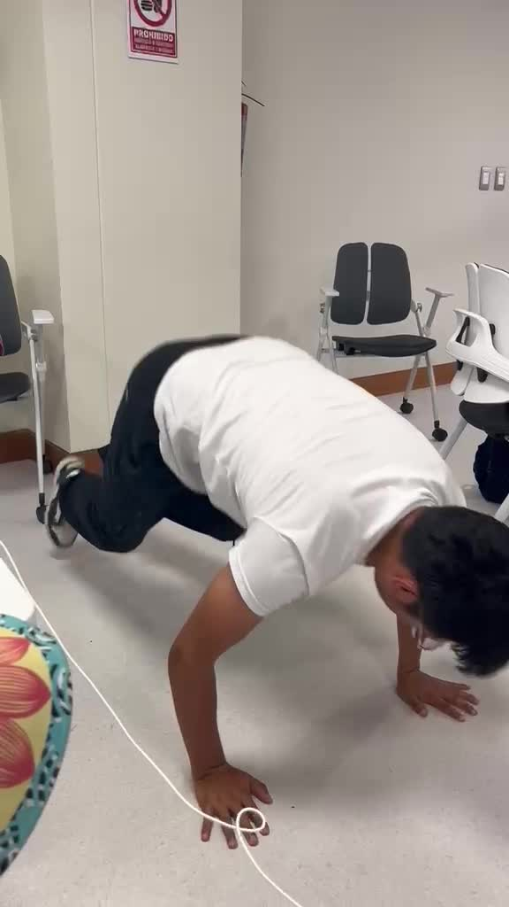](videos/video_actividad_fisica.mp4)

**Video 3.** Ejecución de actividad física (burpees) durante el protocolo experimental.

</div>

### Video 4. Visualización de la señal en OpenSignals

<div align="center">

[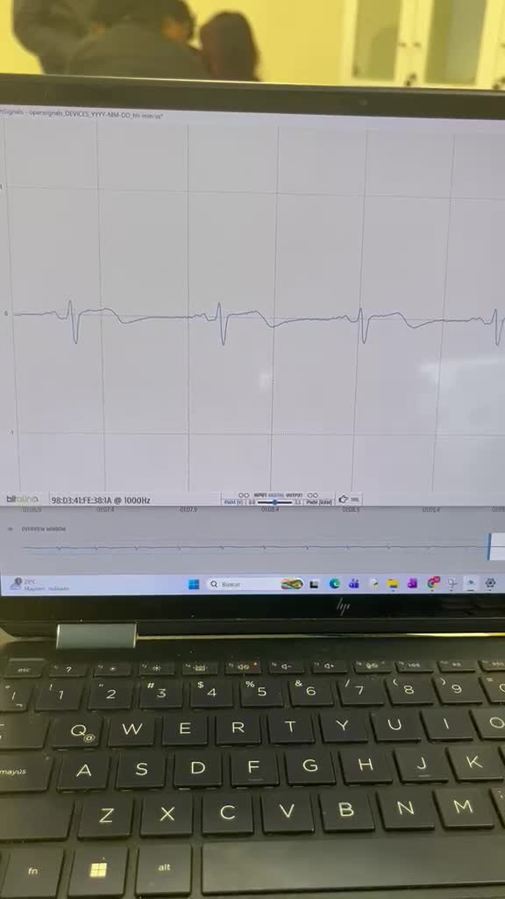](videos/video_opensignals.mp4)

**Video 4.** Señal ECG observada en tiempo real mediante OpenSignals (r)evolution.

</div>

---

# 5. Guardado y procesamiento de datos

OpenSignals generó archivos `.h5` y `.txt`. Los registros empleados en este resumen corresponden al sensor **ECGBIT**, canal etiquetado como **A2**, con frecuencia de muestreo de **1000 Hz**.

Los archivos `.h5` almacenan los datos de forma estructurada. En los archivos utilizados, la señal se encuentra en:

```text
<dispositivo>/raw/channel_2
```

y la frecuencia de muestreo aparece como atributo del grupo del dispositivo.

El código utilizado para leer los registros y generar las gráficas se encuentra en:

```text
src/procesamiento_ecg.py
```

Ejemplo simplificado:

```python
import h5py
import numpy as np
import matplotlib.pyplot as plt

with h5py.File("data/lecturabasalD2.h5", "r") as h5:
    device = next(iter(h5.keys()))
    fs = int(h5[device].attrs["sampling rate"])
    ecg = np.asarray(h5[device]["raw"]["channel_2"]).squeeze()

t = np.arange(len(ecg)) / fs

plt.plot(t, ecg)
plt.xlabel("Tiempo (s)")
plt.ylabel("Amplitud (cuentas ADC)")
plt.show()
```

---

# 6. Registros disponibles

| Condición | D1 | D2 | D3 |
|---|:---:|:---:|:---:|
| Basal | — | ✓ | ✓ |
| Hiperventilación | ✓ | ✓ | ✓ |
| Hipoventilación | ✓ | ✓ | ✓ |

No se recibió un registro **basal D1**, por lo que esa condición no se incluye en los resultados.

No se recibió un registro ECG digital identificado específicamente como **post-esfuerzo**, por lo que no se presenta una gráfica post-esfuerzo. Sin embargo, sí se incluye evidencia audiovisual de la actividad física realizada durante el protocolo.

---

# 7. Resultados

Las gráficas siguientes muestran segmentos representativos de aproximadamente 10 s. Para facilitar la visualización, la señal se presenta como **amplitud relativa respecto de su mediana**, en cuentas del convertidor analógico-digital (ADC).

## 7.1. Condición basal

### D2

<div align="center">
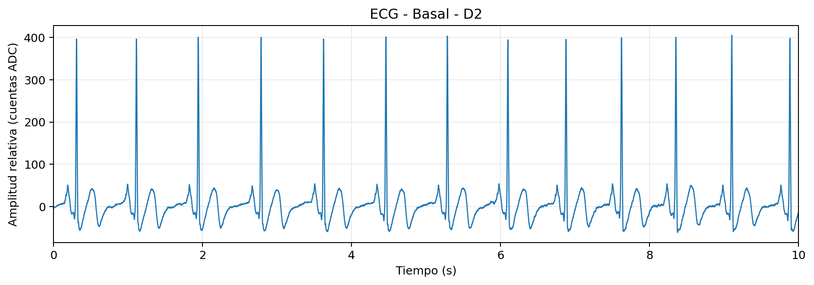

**Figura 6.** ECG en condición basal, derivación D2.
</div>

### D3

<div align="center">
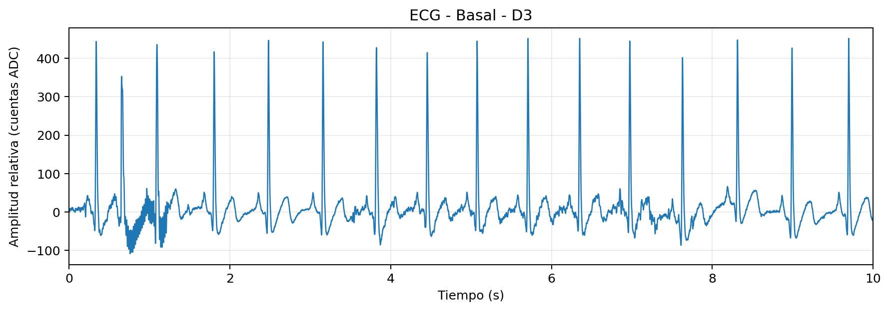

**Figura 7.** ECG en condición basal, derivación D3.
</div>

En ambos registros se observan complejos repetitivos asociados a los latidos cardíacos. La diferencia de amplitud y morfología entre D2 y D3 es consistente con el hecho de que cada derivación mide una proyección distinta del vector eléctrico cardíaco.

---

## 7.2. Hiperventilación

### D1

<div align="center">
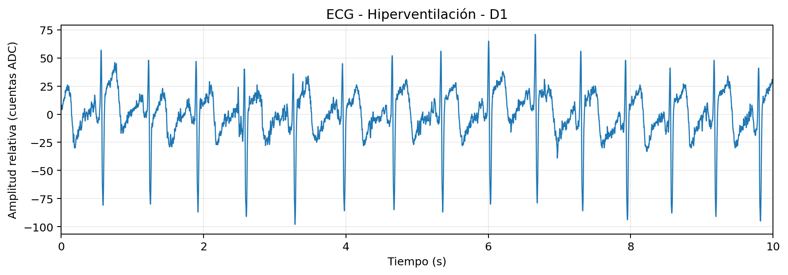

**Figura 8.** ECG durante hiperventilación, D1.
</div>

### D2

<div align="center">
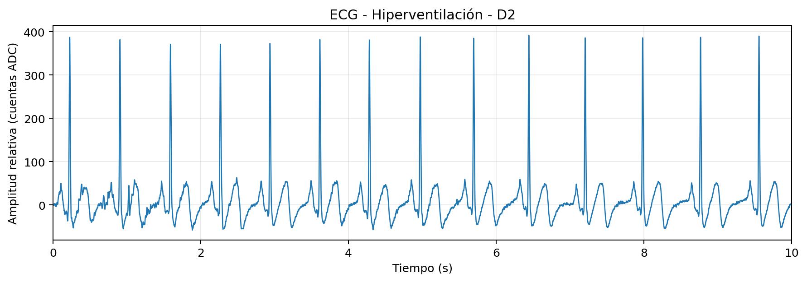

**Figura 9.** ECG durante hiperventilación, D2.
</div>

### D3

<div align="center">
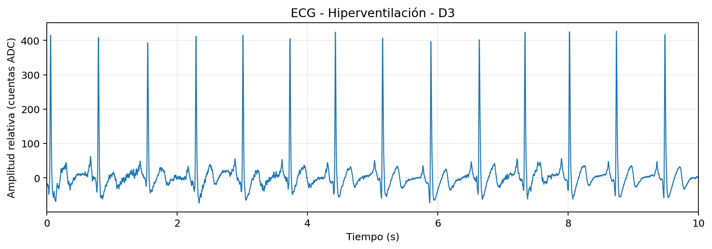

**Figura 10.** ECG durante hiperventilación, D3.
</div>

Las tres derivaciones presentan diferencias claras de polaridad, amplitud y forma. D1 muestra complejos con menor excursión que D2 y D3 en estos registros, lo que puede explicarse por la orientación del eje de la derivación respecto al vector eléctrico cardíaco.

---

## 7.3. Hipoventilación / retención respiratoria

### D1

<div align="center">
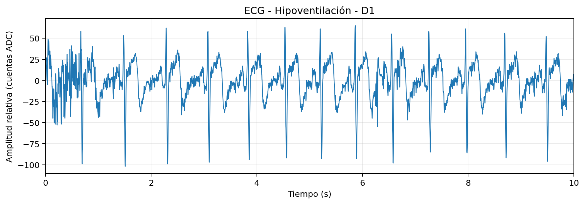

**Figura 11.** ECG durante hipoventilación, D1.
</div>

### D2

<div align="center">
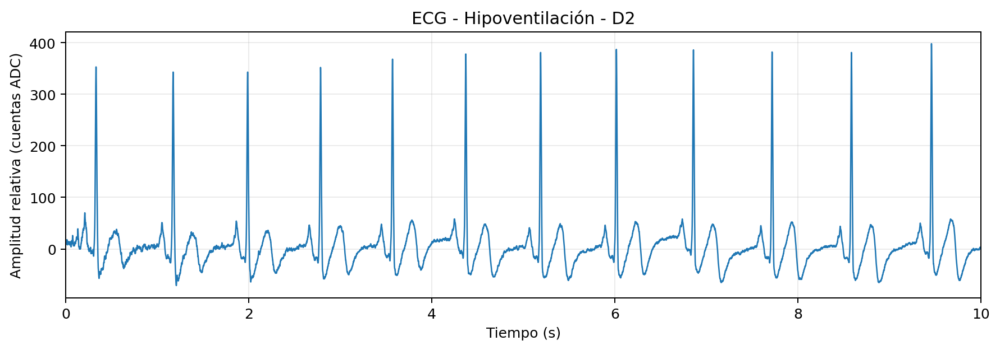

**Figura 12.** ECG durante hipoventilación, D2.
</div>

### D3

<div align="center">
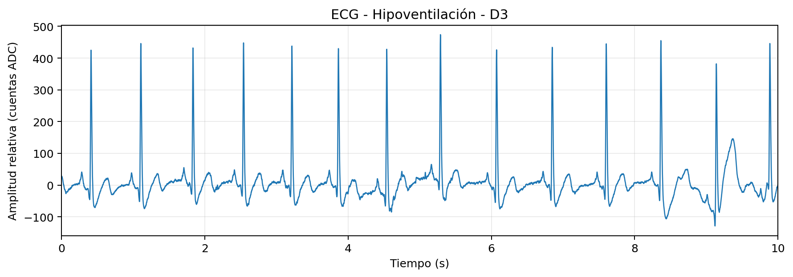

**Figura 13.** ECG durante hipoventilación, D3.
</div>

---

# 8. Análisis de frecuencia cardíaca

El intervalo entre dos complejos R consecutivos se denomina **intervalo RR**. A partir de este intervalo puede estimarse la frecuencia cardíaca:

\[
FC = \frac{60}{RR}
\]

donde `RR` se expresa en segundos.

Se realizó una detección automática de los complejos principales para obtener una **estimación descriptiva** de la frecuencia cardíaca. Debido a que las adquisiciones son cortas y corresponden a registros separados, estos valores no deben interpretarse como una evaluación clínica.

| Condición | Derivación | Duración del archivo | FC estimada |
|---|---|---:|---:|
| Basal | D2 | 11.25 s | 74.2 lpm |
| Basal | D3 | 32.10 s | 84.2 lpm |
| Hiperventilación | D1 | 21.60 s | 89.8 lpm |
| Hiperventilación | D2 | 19.95 s | 80.2 lpm |
| Hiperventilación | D3 | 27.15 s | 81.1 lpm |
| Hipoventilación | D1 | 19.35 s | 82.8 lpm |
| Hipoventilación | D2 | 21.15 s | 74.2 lpm |
| Hipoventilación | D3 | 20.70 s | 79.6 lpm |

<div align="center">
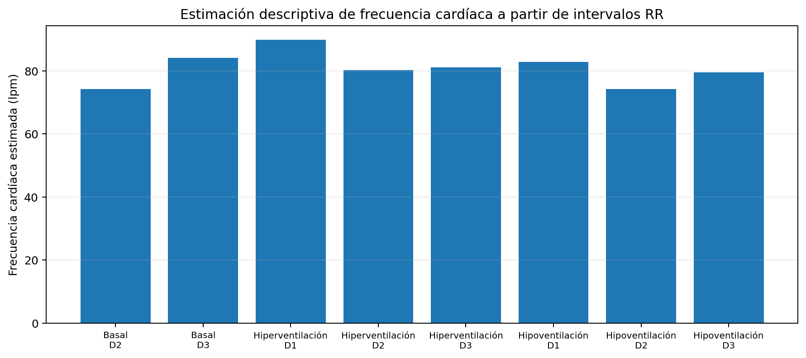

**Figura 14.** Estimación descriptiva de la frecuencia cardíaca en los registros disponibles.
</div>

Para D1 y D2, la frecuencia estimada fue mayor durante hiperventilación que durante hipoventilación. En D3 la diferencia fue pequeña. No debe asumirse una tendencia universal a partir de estos registros porque las mediciones fueron realizadas en momentos distintos y con duraciones diferentes.

---

# 9. Discusión

## 9.1. Efecto de la derivación

Las diferencias entre D1, D2 y D3 no significan que el corazón haya generado una actividad distinta en cada caso. Cada derivación mide la proyección de la actividad eléctrica cardíaca sobre un eje diferente.

Por esta razón pueden cambiar:

- la amplitud del complejo QRS;
- la polaridad de las ondas;
- la visibilidad relativa de P, QRS y T;
- la forma global de la señal.

## 9.2. Efecto de la respiración

La respiración puede modificar el ECG por dos mecanismos observables durante la práctica:

- cambios fisiológicos en el intervalo entre latidos;
- desplazamiento mecánico del tórax y cambio de posición relativa entre corazón y electrodos.

Por ello, al comparar respiración normal, hiperventilación e hipoventilación pueden aparecer cambios en los intervalos RR, la amplitud y la línea base.

## 9.3. Movimiento y actividad física

El movimiento es una fuente importante de artefactos. Durante el ejercicio pueden aparecer:

- actividad electromiográfica de músculos esqueléticos;
- desplazamiento de los electrodos;
- movimiento de los cables;
- cambios en el contacto electrodo-piel.

Esto dificulta identificar con claridad la morfología P–QRS–T durante movimientos intensos. Por ese motivo, el análisis morfológico se realiza preferentemente sobre segmentos con el sujeto inmóvil.

## 9.4. Principales fuentes de ruido

Las fuentes más comunes consideradas en esta práctica fueron:

- movimiento del participante;
- contracción muscular;
- desplazamiento de cables;
- mal contacto electrodo-piel;
- mala adherencia de los electrodos;
- interferencia eléctrica;
- variaciones de la línea base asociadas a la respiración.

---

# 10. Relación entre la clase y el laboratorio

La práctica permitió relacionar directamente los conceptos revisados en clase con señales reales:

- La actividad eléctrica cardíaca puede detectarse desde la superficie corporal.
- Los complejos observados en el ECG están relacionados con los procesos de despolarización y repolarización.
- La posición de los electrodos determina la derivación y modifica la apariencia de la señal.
- El intervalo RR permite estimar la frecuencia cardíaca.
- La respiración y el movimiento introducen variaciones fisiológicas y artefactos que deben considerarse durante la interpretación.

---

# 11. Conclusiones

- Se adquirieron señales ECG utilizando BITalino y OpenSignals con una frecuencia de muestreo de 1000 Hz.
- Se observaron diferencias de amplitud, polaridad y morfología entre las derivaciones de Einthoven.
- Los registros permitieron comparar condiciones basales, hiperventilación e hipoventilación.
- La respiración produjo variaciones observables en el ritmo y en la forma de la señal, aunque los resultados deben interpretarse considerando que las adquisiciones fueron independientes.
- El movimiento y la actividad muscular constituyen fuentes importantes de artefactos en ECG.
- Los archivos `.h5` y `.txt` pudieron utilizarse en Python para recuperar, representar y analizar las señales fuera de OpenSignals.
- La práctica permitió conectar los fundamentos teóricos de conducción cardíaca, ondas del ECG y derivaciones con registros experimentales reales.

---

# 12. Estructura de archivos

```text
ECG_Lab4_completo/
├── Resume.md
├── data/
│   ├── lecturabasalD2.h5
│   ├── lecturabasalD2.txt
│   ├── lecturabasalD3.h5
│   ├── lecturabasalD3.txt
│   ├── lecturahiperventilacionD1.h5
│   ├── lecturahiperventilacionD1.txt
│   ├── lecturahiperventilacionD2.h5
│   ├── lecturahiperventilacionD2.txt
│   ├── lecturahiperventilacionD3.h5
│   ├── lecturahiperventilacionD3.txt
│   ├── lecturahipoventilacionD1.h5
│   ├── lecturahipoventilacionD1.txt
│   ├── lecturahipoventilacionD2.h5
│   ├── lecturahipoventilacionD2.txt
│   ├── lecturahipoventilacionD3.h5
│   └── lecturahipoventilacionD3.txt
├── images/
│   ├── montaje_electrodos.png
│   ├── basal_D2.png
│   ├── basal_D3.png
│   ├── hiperventilacion_D1.png
│   ├── hiperventilacion_D2.png
│   ├── hiperventilacion_D3.png
│   ├── hipoventilacion_D1.png
│   ├── hipoventilacion_D2.png
│   ├── hipoventilacion_D3.png
│   └── frecuencia_cardiaca_estimada.png
└── src/
    └── procesamiento_ecg.py
```

---

# Referencias

1. Material de clase: **Electrocardiograma: Anatomía del corazón, Ondas del ECG, Derivaciones, Características y Arritmias**.
2. PLUX Wireless Biosignals. **BITalino (r)evolution Home Guide #2 – Electrocardiography (ECG)**.
3. Registros experimentales del laboratorio procesados con OpenSignals y Python.
