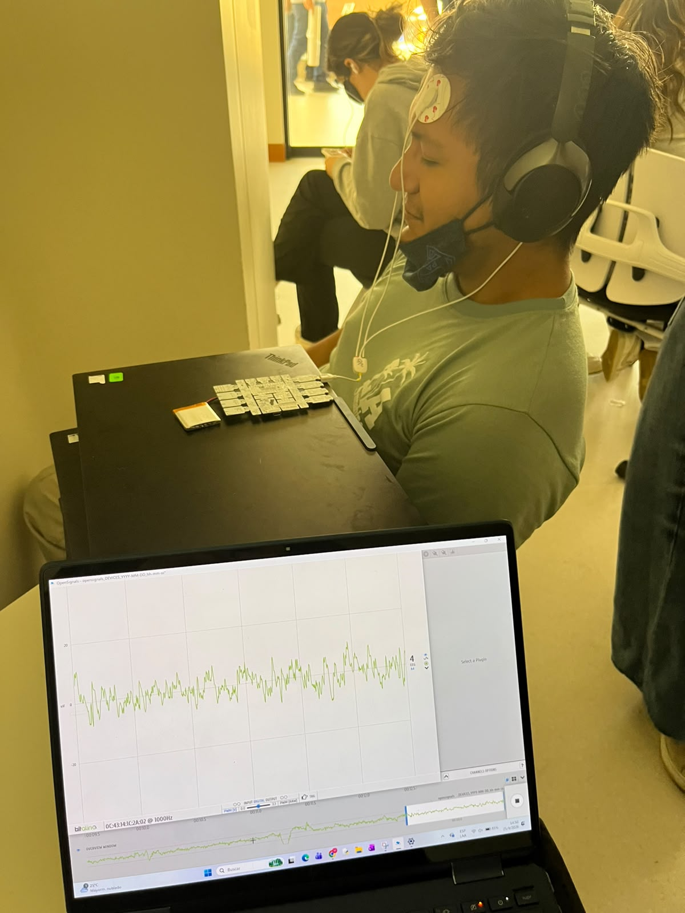
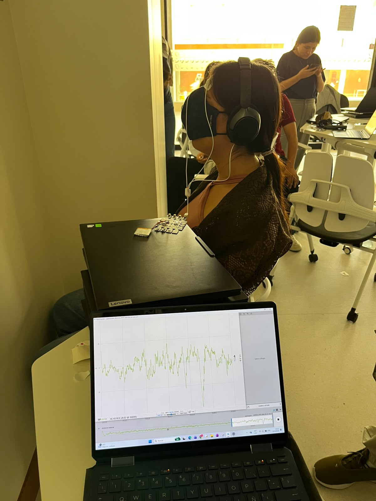
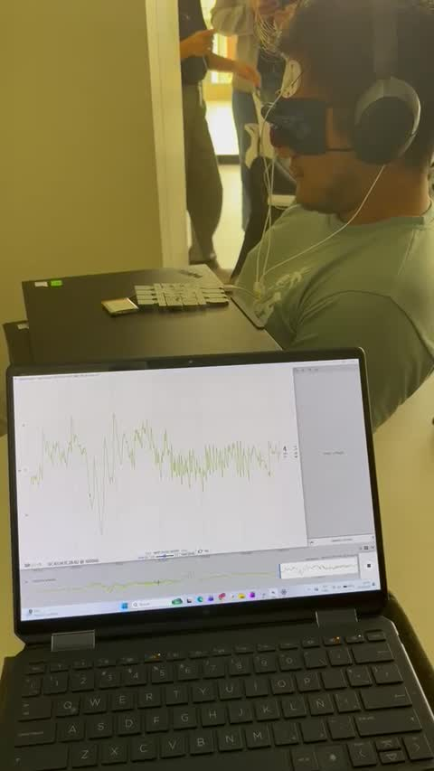
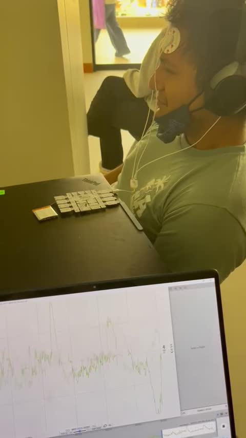
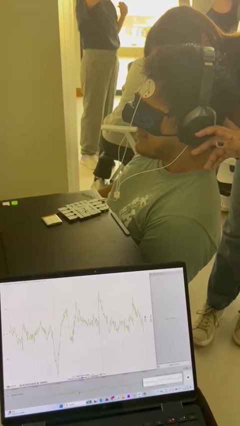
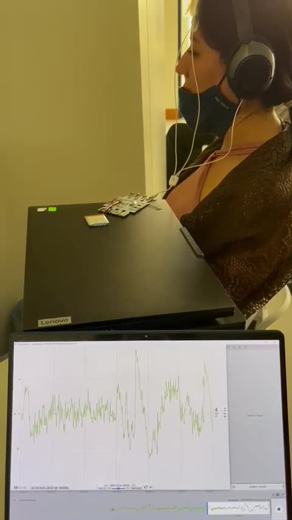

# Laboratorio 6: Adquisición de EEG con BITalino y OpenSignals

**Curso:** Introducción a Señales Biomédicas  
**Grupo:** 10 | **Ciclo:** 2026-II

## Introducción

La sesión permitió relacionar los fundamentos de la **electroencefalografía (EEG)** con la adquisición de una señal mediante **BITalino** y su visualización en **OpenSignals**. El EEG registra diferencias de potencial en la superficie de la cabeza, asociadas principalmente con la actividad postsináptica conjunta de poblaciones de neuronas corticales.

Durante la práctica se documentó el montaje frontal en dos participantes y se observó la evolución del trazado. Las fotografías y los videos permiten describir la adquisición y discutir la importancia del contacto de los electrodos y del control de movimientos.

---

## Objetivos

- Comprender el origen fisiológico de la señal EEG.
- Reconocer las principales bandas de frecuencia y su relación con la vigilia y el sueño.
- Identificar la función de los electrodos y del sistema internacional 10-20.
- Familiarizarse con la adquisición mediante BITalino y OpenSignals.
- Observar variaciones del trazado y reconocer posibles fuentes de artefactos.

---

# 1. Fundamento teórico

## 1.1. Origen de la señal EEG

El sistema nervioso central comprende el encéfalo y la médula espinal; el periférico incluye nervios y ganglios. Las neuronas se comunican mediante sinapsis que producen respuestas excitadoras o inhibidoras. En el EEG de superficie destaca la contribución de las neuronas piramidales, cuya orientación favorece la suma de sus campos eléctricos. El registro refleja actividad colectiva, no el potencial de acción de una neurona aislada.

Los tejidos entre la corteza y los electrodos atenúan y distribuyen espacialmente la señal, que se expresa habitualmente en microvoltios (µV). Los circuitos entre el tálamo y la corteza participan en la generación de ritmos durante la vigilia y el sueño. [1, diap. 7–14; 2, p. 8]

| Región cerebral | Funciones relacionadas revisadas en clase |
|---|---|
| Frontal | Planificación, atención, razonamiento y control motor voluntario. |
| Parietal | Integración sensorial y orientación espacial. |
| Temporal | Audición, memoria y procesamiento del lenguaje. |
| Occipital | Procesamiento de información visual. |

## 1.2. Electrodos, canales y sistema 10-20

Un canal de EEG representa una **diferencia de potencial entre dos puntos**. El sistema internacional 10-20 permite ubicar electrodos según proporciones de las dimensiones de la cabeza, utilizando referencias anatómicas como el nasion y el inion.

- Las letras indican la región: Fp (frontopolar), F (frontal), C (central), P (parietal), T (temporal) y O (occipital).
- Los números impares corresponden al hemisferio izquierdo y los pares al derecho.
- La letra **z** identifica la línea media.

El montaje bipolar de BITalino utiliza dos entradas de medición, **IN+ e IN−**, y una conexión adicional de referencia. La guía propone colocar esta referencia en una zona ósea detrás de la oreja. La práctica documentada muestra un montaje frontal; las fotografías no permiten confirmar su correspondencia exacta con Fp1 o Fp2. [1, diap. 31–32; 2, pp. 10–12]

## 1.3. Bandas de frecuencia

Las bandas permiten describir el contenido de frecuencia de una señal. Sus límites varían ligeramente entre las fuentes; la tabla utiliza los rangos de la clase.

| Banda | Frecuencia en la clase | Asociación general |
|---|---|---|
| Delta | 0,5–4 Hz | Sueño profundo. |
| Theta | 4–8 Hz | Somnolencia y etapas iniciales del sueño. |
| Alfa | 8–13 Hz | Vigilia relajada; puede aumentar al cerrar los ojos. |
| Beta | 13–30 Hz | Vigilia activa y actividad mental. |
| Gamma | 30–100 Hz | Procesos de atención e integración de información. |

La guía de BITalino emplea alfa de 8–12 Hz, beta de 12–25 Hz y gamma por encima de 25 Hz. Por ello, en un análisis cuantitativo habría que declarar los intervalos elegidos. Además, el ancho de banda del sensor descrito en la guía, **0,8–48 Hz**, no permite estudiar íntegramente todos los rangos de la tabla. [1, diap. 33–34; 2, pp. 9–12]

## 1.4. Sueño y aplicaciones del EEG

La clase distingue sueño **no REM** (N1, N2 y N3) y **REM**. N1 corresponde a la transición desde la vigilia; N2 presenta husos del sueño y complejos K; N3 se caracteriza por actividad delta de gran amplitud. REM presenta actividad de baja amplitud y frecuencias mixtas. Aquí se sigue la clasificación N1–N3 de las diapositivas 35–36, ya que las diapositivas previas de ritmos emplean otra numeración de etapas.

También se revisaron Alzheimer, accidente cerebrovascular, meningitis y epilepsia como contexto de las alteraciones neurológicas. Se presentaron modalidades de EEG de rutina, prolongado, ambulatorio y video-EEG. En el estudio del sueño, la polisomnografía combina EEG con señales oculares, musculares, respiratorias y de oxigenación. Como aplicaciones adicionales se discutieron las interfaces cerebro-computadora y la combinación de EEG con estimulación magnética transcraneal. [1, diap. 17–40; 2, p. 13]

---

# 2. Materiales y configuración de adquisición

En las evidencias se observan:

- Placa BITalino y batería.
- Sensor de EEG con electrodos adhesivos en la frente y cables de conexión.
- Computadora con OpenSignals para visualizar la señal.
- Audífonos utilizados por los participantes.

La guía especifica electrodos pregelificados de Ag/AgCl, dos contactos de medición y una referencia adicional. Los audífonos son visibles, pero las imágenes no permiten determinar qué audio se reprodujo ni establecer su efecto sobre el registro. [2, pp. 6 y 11–12]

En la interfaz fotografiada se distingue una frecuencia de muestreo de **1000 Hz** y un canal identificado como **4 / EEG / A4**. La frecuencia de muestreo indica cuántas muestras se adquieren por segundo; no corresponde a la frecuencia de las ondas cerebrales.

**Secuencia general del sistema:**

`Electrodos → sensor EEG → BITalino → computadora → OpenSignals`

---

# 3. Colocación del sensor y registro

## 3.1. Primer participante

Se colocó el sensor en la zona frontal y se conectó al sistema BITalino. El participante permaneció sentado, con audífonos, mientras la señal se visualizaba en la computadora.

<div align="center">



**Figura 1.** Montaje frontal y visualización de la señal EEG en el primer participante.

</div>

El montaje permite reconocer los electrodos sobre la frente, los cables y la placa de adquisición. La guía describe dos entradas de medición y una referencia adicional detrás de la oreja; la fotografía no muestra con claridad todas las conexiones ni confirma una posición exacta Fp1 o Fp2.

## 3.2. Segunda participante

También se documentó la adquisición en una segunda participante, utilizando un montaje frontal y la visualización del trazado en OpenSignals.

<div align="center">



**Figura 2.** Registro en la segunda participante; se observan oscilaciones y deflexiones de distinta amplitud.

</div>

Las diferencias visibles entre ambas imágenes no permiten establecer cuál participante presentó mayor concentración o potencia en una banda determinada, porque no corresponden a una comparación controlada de los datos digitales.

---

# 4. Protocolo de referencia

La guía plantea la siguiente secuencia para comparar condiciones: [2, pp. 14–15]

1. Preparar el montaje frontal y colocar la referencia detrás de la oreja.
2. Configurar OpenSignals y seleccionar una frecuencia de muestreo apropiada para el ancho de banda.
3. Registrar una línea base de 30 segundos, procurando evitar movimientos.
4. Alternar ojos abiertos y cerrados cinco veces, manteniendo cada condición durante cinco segundos.
5. Registrar otra línea base de 30 segundos.
6. Realizar cálculos mentales y guardar la adquisición.
7. Repetir la experiencia en Fp2, Fp1 y O2 para comparar ubicaciones.

Esta secuencia describe la propuesta de la guía. Las evidencias aportadas no documentan por completo sus tiempos, repeticiones, cálculos mentales o cambios de ubicación, por lo que no se presentan como etapas verificadas de nuestra sesión.

---

# 5. Evidencia audiovisual de la práctica

Los siguientes videos corresponden a los archivos aportados de la sesión. **Haz clic en cada imagen o en “Abrir video” para acceder al archivo.** Las vistas previas son fotogramas de los videos originales.

## 5.1. Adquisición de EEG en el primer participante

<div align="center">

<a href="evidencias/video-eeg-01.mp4"></a>

**Video 1.** Montaje frontal conectado a BITalino y visualización del trazado durante la adquisición.

[▶ Abrir video 1](evidencias/video-eeg-01.mp4)

</div>

---

## 5.2. Evolución de la señal en OpenSignals

<div align="center">

<a href="evidencias/video-eeg-02.mp4"></a>

**Video 2.** Variaciones del trazado observadas durante la continuación del registro del primer participante.

[▶ Abrir video 2](evidencias/video-eeg-02.mp4)

</div>

---

## 5.3. Ajustes de los audífonos durante el registro

<div align="center">

<a href="evidencias/video-eeg-03.mp4"></a>

**Video 3.** Manipulación de los audífonos durante la adquisición, un evento que conviene anotar al revisar posibles artefactos.

[▶ Abrir video 3](evidencias/video-eeg-03.mp4)

</div>

---

## 5.4. Adquisición de EEG en la segunda participante

<div align="center">

<a href="evidencias/video-eeg-04.mp4"></a>

**Video 4.** Segunda participante con montaje frontal y señal visualizada en OpenSignals.

[▶ Abrir video 4](evidencias/video-eeg-04.mp4)

</div>

---

# 6. Observaciones y discusión

| Observación en las evidencias | Interpretación y alcance |
|---|---|
| OpenSignals muestra un trazado variable durante el registro. | Se documenta la adquisición y visualización de la señal del canal EEG. |
| Hay oscilaciones de menor amplitud y deflexiones más pronunciadas. | La amplitud cambia en el tiempo; una deflexión grande, por sí sola, no demuestra mayor actividad cerebral ni concentración. |
| El montaje se encuentra cerca de los ojos y músculos faciales. | Los parpadeos, movimientos oculares y contracciones pueden contaminar el registro. |
| Se observan ajustes de los audífonos durante un video. | Son eventos relevantes para revisar posibles artefactos; no se puede atribuir cada pico a una causa sin sincronización precisa. |
| Se registró a dos participantes. | Las imágenes no bastan para comparar su potencia por bandas ni su estado de atención. |

La guía describe una ganancia de **40 000** y un filtrado pasabanda de **0,8–48 Hz** para el sensor. La elevada sensibilidad hace importante mantener un buen contacto electrodo-piel y reducir movimientos e interferencia eléctrica. El filtrado limita frecuencias no deseadas, pero no elimina necesariamente artefactos que comparten el rango del EEG. [2, p. 12]

Según la guía, cerrar los ojos durante la vigilia relajada puede favorecer la actividad alfa. Sin embargo, para comprobarlo en esta práctica se necesitarían los datos originales, segmentos identificados por condición y un análisis espectral. **Las fotos y los videos del trazado no permiten afirmar que predominó una banda específica ni cuantificar cambios de potencia.**

El material recibido contiene evidencia visual, pero no archivos de señal exportados de OpenSignals. Por ello, este resumen presenta observaciones cualitativas: no se calcularon espectros, amplitudes exactas, diferencias entre Fp1 y Fp2 ni indicadores de concentración.

---

# 7. Relación entre la clase y el laboratorio

- **Origen de la señal:** la práctica mostró cómo una medición de superficie permite visualizar variaciones eléctricas mediante un sistema de adquisición EEG.
- **Montaje:** la posición de los electrodos y la diferencia de potencial medida por el canal son esenciales para interpretar el registro.
- **Ritmos:** las bandas estudiadas en clase describen el contenido de frecuencia; para identificarlas en estos registros se necesitan los datos digitales y un análisis espectral.
- **Artefactos:** los movimientos oculares, la actividad muscular y los cambios en el contacto de los electrodos pueden alterar el trazado.
- **Muestreo:** los 1000 Hz visibles en OpenSignals corresponden a la adquisición digital y deben distinguirse de los rangos delta, theta, alfa, beta y gamma.

---

# 8. Conclusiones

- Se documentó la adquisición de una señal EEG mediante BITalino y su visualización en OpenSignals, con una frecuencia de muestreo indicada de 1000 Hz.
- Las fotografías muestran un montaje frontal en dos participantes y los videos permiten observar la evolución del trazado.
- La calidad del registro depende del contacto de los electrodos y del control de movimientos e interferencias.
- Una mayor amplitud no equivale directamente a mayor concentración: los artefactos también pueden producir deflexiones pronunciadas.
- Para comparar condiciones como ojos abiertos y cerrados o tareas mentales se necesitan registros digitales con cada condición identificada y un análisis por bandas.

---

# 9. Estructura de archivos

```text
Laboratorio 6/
├── README.md
└── evidencias/
    ├── registro-eeg-01.jpeg
    ├── registro-eeg-02.jpeg
    ├── video-eeg-01.mp4
    ├── video-eeg-01-preview.jpg
    ├── video-eeg-02.mp4
    ├── video-eeg-02-preview.jpg
    ├── video-eeg-03.mp4
    ├── video-eeg-03-preview.jpg
    ├── video-eeg-04.mp4
    └── video-eeg-04-preview.jpg
```

---

# Referencias

1. De La Cruz, L.; Meza, M.; Cáceres, J. A. **Electroencefalograma: Ritmos, medición, adquisición y canales.** Material de clase proporcionado: `Clase EEG_2026_02.pptx`, 44 diapositivas.
2. PLUX – Wireless Biosignals. **BITalino Home-Guide #3: Electroencephalography (EEG), Exploring Brain Signals.** Material proporcionado: `HomeGuide3_EEG.pdf`, versión fechada el 15/02/2021. Se consultaron especialmente las páginas 8–15.
3. **Evidencias del grupo:** dos fotografías y cuatro videos proporcionados, identificados en sus nombres como archivos del 25/09/2026 e incluidos en la carpeta `evidencias/`.
